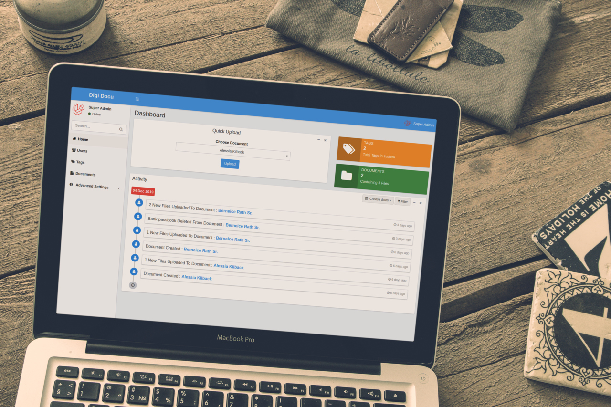

# Persian-Document-Management-System---Laravel
A Web-Based DMS using Laravel framework. It is an extended version of DigiDocu that is a free, open source document management system built with laravel. Which provide easy way to manage documents with features like permissions, resize &amp; compress images, combine multiple images into single pdf, zip all files etc..

This version provided for persian language usage. The original version is accessible in [Link](https://github.com/harish81/digidocu)

## Installation
1. Download the latest release or clone repository.
2. Run `composer install`.
3. Copy & setup `.env` file.
4. Create database & Change `DB_DATABASE` in `.env`.
5. Migrate the Database `php artisan migrate`.
6. Run `php artisan key:generate`
7. Run `php artisan db:seed` (This will generate super-admin & basic settings [required]).
8. Visit URL in the browser

##### Default Login Credential for super admin
| Username | Password |
|----------|----------|
| super    | 123456   |

## Documentation
1. [User Documentation](https://nandoliyaharish.gitbook.io/digidocu/user)
2. [Developer Documentation](https://nandoliyaharish.gitbook.io/digidocu/dev)
